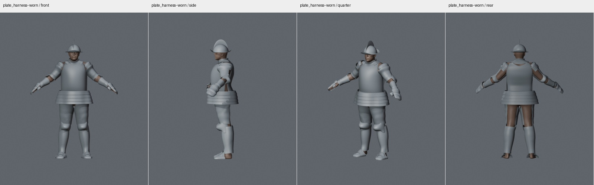
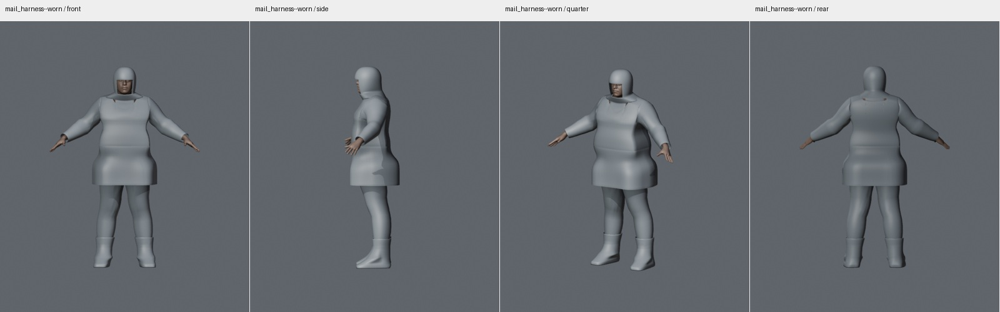
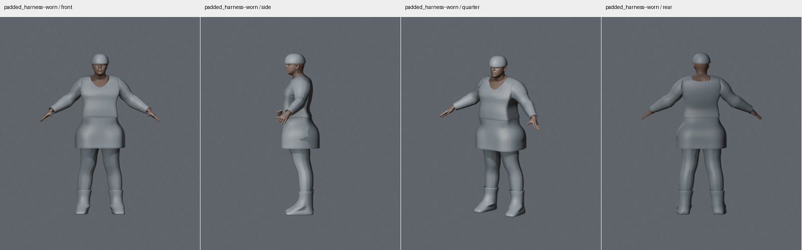
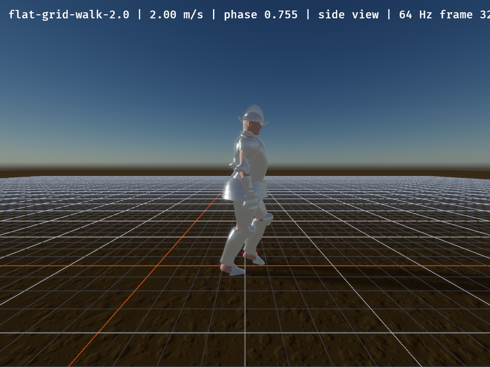
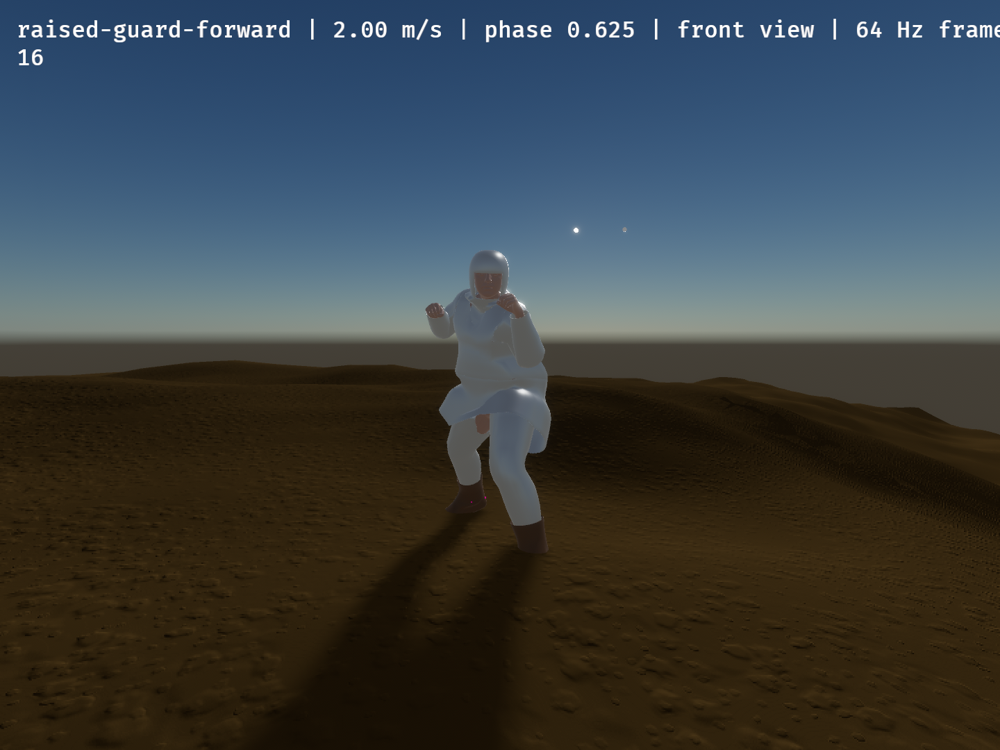

# Parametric armor review

This evidence covers all 33 armor catalog entries and the leather boots: 48
placement meshes. The three ordinary clothing assets remain outside the armor
generator. The images below render the installed GLBs with their exported
normals and back-face culling, on the actual body.

The target is simple period-appropriate construction and proportions, adapted
to the wearer. Decoration, straps, rivets, functional hinges, individual mail
rings and exact replicas are outside this mesh scope. Recipe families and
style controls are described in the [crate README](../README.md).

## Installed outfits

The [parts directory](parts/) contains front, side, three-quarter and rear
boards for every placement. The [outfits directory](outfits/) also includes
positive, negative and alternating identity blends. These are evaluated from
the exported morph targets, without generating substitute fitted meshes.

## Static checks

- All 48 GLBs pass closed physical-edge winding, finite attribute, skin-weight,
  fixed correspondence and triangle-area checks at all 47 morph endpoints and
  three combined identity blends. Coincident UV/hard-normal seams are welded
  at one micrometre for the physical-edge check.
- Neutral and three combined identity configurations each pass all 48 meshes:
  no sampled vertex, face centroid or edge midpoint lies more than 1 mm inside
  the body. These bounded nearest-surface diagnostics do not prove continuous
  collision clearance or every possible parameter combination.
- [Static audit](static-audit.json) records installed asset hashes, body
  coefficients and per-piece measurements. The retained breastplate and
  vambraces correctly retain generator version 8; new exports use version 9.
- [Independent regression review](static-regression-review.md) records the
  final four-body visual assessment and its limits. Broad historical reviewers
  separately assessed the helmet, limb and garment families during iteration.

Boot shafts fit outside cross-sections of the supported default mail and
padded chausses. A conservative ankle transition joins that envelope to the
vamp. The [boot layering audit](boot-layering.json) checks both legs at neutral,
all 47 morph endpoints and three identity blends. Reproduce it with
`blender --background --python scripts/check_boot_layering.py -- assets/equipment/procedural OUTPUT.json`.
Custom garment dimensions and animated poses need their own fit review.
The [boot artistic review](boot-artistic-review.md) assesses the
[front](boot/combined-front.png), [side](boot/combined-side.png) and
[three-quarter](boot/combined-quarter.png) source-preview views; orange is
leather, cyan is mail and magenta is the body. The ordinary exported GLBs are
reviewed separately in the part and outfit boards above.

## Historical shape references

Reference examples include the Met's [morion](https://www.metmuseum.org/art/collection/search/27150),
[barbute](https://www.metmuseum.org/art/collection/search/27960) and
[greaves](https://www.metmuseum.org/art/collection/search/22970), Cleveland's
[kettle hat](https://www.clevelandart.org/art/1916.1919) and
[open burgonet](https://www.clevelandart.org/art/1916.1642), Fitzwilliam's
[cuisses and poleyns](https://data.fitzmuseum.cam.ac.uk/id/object/17761) and
[mitten gauntlets](https://data.fitzmuseum.cam.ac.uk/id/object/17694), the
[Visby coif study](https://www.djurfeldt.com/patrik/mailcoif.html), and
[Leicestershire's working leather boot](https://leicestershirecollections.org.uk/archaeology/medieval-coal-mining).
The arming-cap reference was a museum reconstruction, not an original-period
survival. The references support construction families rather than a claim
that the combined outfits reproduce one surviving historical harness.

## Reproduction

The [creator README](../../adventuresim-character-creator/README.md#parametric-armor-authoring)
documents typed design overrides, filtered exports, GLB audits, static renders
and native armor capture fixtures. Use the installed asset manifest and the
same body coefficients when comparing a new candidate with this evidence.

## Runtime checks

The native viewer uses the gameplay equipment renderer. Fifteen captures cover
plate, mail and padded outfits in idle, walking and raised guard, plus idle at
both spine-length extremes. All captures completed without GPU layout errors;
all three raised-guard runs passed the full viewer validator. Each piece had to
resolve its mesh, material, morphs and complete wearer skin before capture.

[Capture results](runtime/runtime-final-summary.json) and
[per-run asset provenance](runtime/provenance/) distinguish the installed
geometry used in each run. Four [boot follow-up captures](runtime/boot-followup-summary.json)
use the corrected pair in mail and padded idle and guard scenarios; the
original captures retain their original asset hashes. All four complete
without GPU errors. Mail guard passes the full validator. The padded guard
follow-up reports a biomechanics/foot-dragging failure with zero jitter;
the two idle follow-ups report startup jitter.

The [independent runtime review](runtime/visual-regression-review.md) records
the original defect and its final image-based follow-up separately.

The viewer's animation validator does not pass every scenario. Matched
unarmored controls reproduce idle startup jitter and the ordinary walking
continuity, biomechanics, ground-penetration, height and repeated-evaluation
failures. The supplemental flat-grid walk exposes the feet and passes ground
penetration. See the [control results](runtime/runtime-supplemental-summary.json).
No animation thresholds were relaxed. Bevy still ignores secondary skin
influences; their total is at most 0.5% for new armor/body and 0.96% for the
retained vambraces in these assets.

These simple pieces preserve openings around joints, hems and necklines. The
fixtures omit ordinary underclothes; a raised skirt can expose the groin
between separate chausses. Region coverage does not imply sealed protection
through every pose. Numerical geometry checks, visual fit and animation
validation are reported separately.
